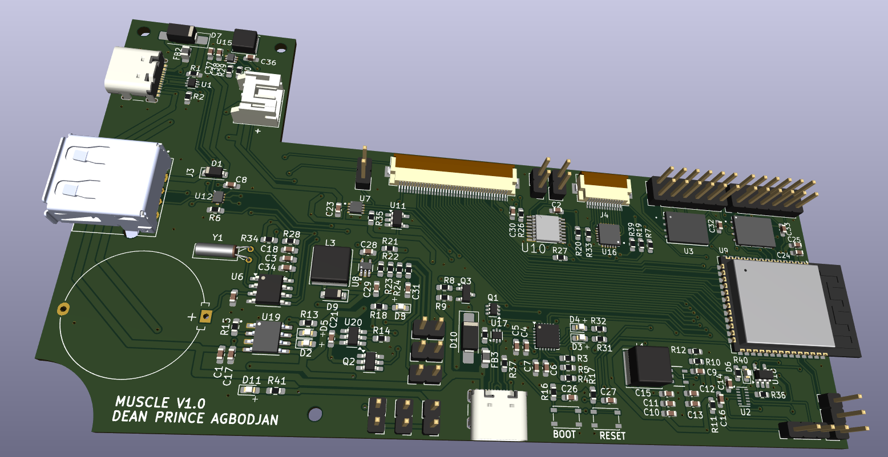
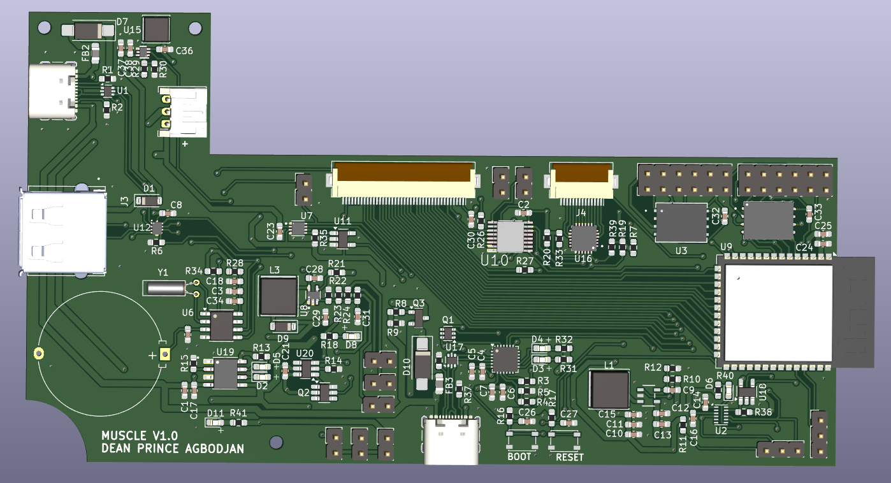
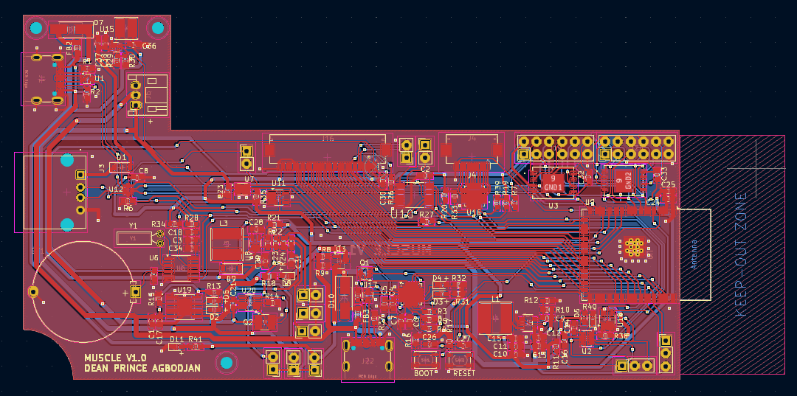

<h2> Battery Powered Two-Layer PCB <h2>

__Note - This is an ongoing project__

## Introduction
This project describes the design and development of a battery-powered, two-layer PCB for a smart point-of-sale (POS) device. The smart point-of-sale device is intended to work with a barcode scanner, identifying items and products with barcode IDs. It comes with a TFT screen and a GUI displaying the product details, including the brand, type, weight, and cost.

## Background of Project
There are numerous small to medium enterprises in Ghana that lack an effective way to track their inventory and finances. The existing implementations are very bulky and expensive, with software that is difficult for an average small shop owner to navigate, and with outrageous monthly subscriptions. This smart point-of-sale (POS) device seeks to simplify and improve the existing solution by creating a quick-to-use, cheap, and portable device. It works with a mobile application that updates the user on every item bought in the shop, giving the user visibility over their shop without their physical presence.

## Hardware and Circuit Design
The PCB was design and developed using KiCad. It comprises of multiple ICs (micocontroller, convertor ICs, and others).

* The Micrcontroller used is the ESP32s3. ESP32s3 is a System-On-Chip(SoC) integrating WiFi and Bluetooth, with peripherals that enable connection with other ICs and modules. 

* The PCBs also integrates ICs such
    - **SY8089 Buck Power Converter** that reduces the input voltage from 5V to 3.3V for the microcontroller and other components in the circuit. It has about 2A output current, with capacitors used as noise filters.
    - **TP4056 and DW01A** that ensure battery health safety by preventing under and over charging.
    - **MAX17048** as a current fuel gauge for the battery.
    - **PCF8523T** serves as an RTC module providing precise time and date information. It is supplied by a coin battery that ensures its continual performance when the device is off.
    - **TCA8418** serves as a keypad scan device through which users can interact with the POS device.
    - **W25N02KVZEIR and W25Q256JVEIQ** that serves as additional flash memory.
    - **PCA95548** serves as additional gpios.